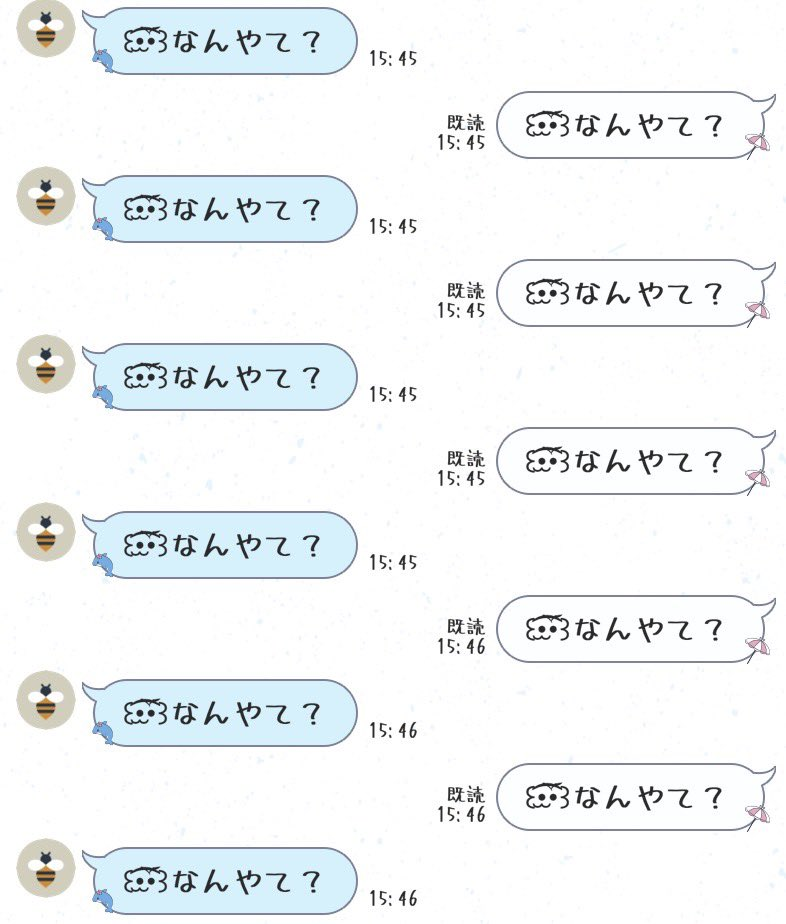

# ☁くもぼうやミニゲームのREADMEへようこそ☁
## 👾 概要
本ミニゲームはくもぼうやが文字をゴールへシュートして遊ぶ物理演算アクションゲームです。  

「くもぼうや」とは、友人との会話中に生まれたオリジナルキャラクターです。  
会話の中で頻出する「なんやて」というワードをゲームのテーマにしました。  

 

## 🎮 遊び方 
  1. 空から降ってくる「ひらがな」をキャッチ！  
  2. 動くゴールを狙って、スペースキーで文字をシュート！  
     ※長押しでパワーを貯めると、遠くへ飛ばせます。  
  3. 時々発生するデバフ「重力変化」や「ゴール隠蔽」を乗り越えて、ハイスコアを目指そう！  
     ※"その他の文字"をゴールの壁に当てることで、デバフカウントをリセットできます。  
     ※"その他の文字"とは"な,ん,や,て"以外の文字のことです。  

**操作方法**  
  移動: `A` `D`キー または `←` `→`キー  
  シュート: `Space`キー(長押しでチャージ)  

**通常モードのスコア計算方法**  
- 「な,ん,や,て」は1文字につき10点  
    ※デバフ発動中にゴールした場合は15点  

- その他の文字は1文字につき-3点  
    ※デバフ発動中にゴールした場合は0点  
    
- ゲーム終了時に揃っていた「なんやて」セット数に応じてボーナス加点！  
    ①  
    「なんやて」セット数 × 10点  

    ②  
    「なんやて」セット数が0個の場合 × 1.0倍  
    「なんやて」セット数が5個以下 × 1.5倍  
    「なんやて」セット数が10個以下 × 2.0倍  
    「なんやて」セット数が11個以上 × 3.0倍  

**フリーモードのなんやてポイント計算方法**  
- 「な,ん,や,て」は1文字につき10点  
    ※デバフ発動中にゴールした場合は15点  

- その他の文字は1文字につき-3点  
    ※デバフ発動中にゴールした場合は0点  

- 100なんやてポイントと引き換えに特殊演出（ポップコーンくもぼうや）を発動！  
    ※ボタンをクリックする必要があります。  

## ⚠機能制限のご案内  
**以下の機能につきまして、システム仕様上の機能制限による不具合のため、現時点での修正予定はありません。**  
- ランキング画面について: 同一スコアの場合の表示順は、サーバーの処理順に依存するため不規則となります。  

- UIの見え方について: 本作はPCでの動作を想定して開発・調整を行っております。特殊な解像度を持つ一部モバイル・タブレット端末では、ブラウザの仕様や解像度の不一致によりUIのレイアウトが崩れ、ゲーム進行が不可となる可能性があります。  

- 文字入力について: 一部モバイル・タブレット端末では文字入力が困難となり、名前登録やフィードバックの送付が出来ない場合があります。別のブラウザやPC環境での実行をお試しください。  

## 🆙 更新履歴  

Ver1.3: フリーモードの仕様変更とゲームバランスの調整  
  
これまで特殊ルールを採用していた『フリーモード』について、一部の仕様を通常モードと統一し、より遊びやすく調整しました。  
- デバフリセットルールの追加: 通常モードと同様に、"その他の文字"をゴールの壁に当てることで、デバフのカウントを交互にリセットできるようになりました。  
- "なんやてポイント"のバランス調整: 特殊演出（ポップコーンくもぼうや）の発動条件を見直し、1文字あたりの獲得ポイントと合計必要ポイントのバランスを調整しました。  
- UIの導入: ゲーム開始時にUIの説明が表示されるようになりました。5秒経過で自動的にフェードアウトするため、遊びやすさは変わりません。  

さらに表示

Ver1.3.1 ~ Ver1.3.10: UIの微調整  
Ver1.3: 上記に記載  
Ver1.2: 特定の条件下で重力値が異常となるバグの修正  
Ver1.1: UIの微調整  
Ver1.0: Release!!!  

## 💬 フィードバックへのお返事  
- ゲーム中のUIが右に寄っています  
  →ご報告ありがとうございます。Ver1.1にて修正しました！ 

さらに表示

- リリースおめでとう～！おつかれさま！
  →ありがとう～！たくさん遊んでね！

## 🔰 制作の背景と目的
本作は、**Unity・C#の学習成果物として制作**しました。  
制作に至った背景は、単にコードの書き方を学ぶだけでなく、ゲームとしての面白さを技術でどう表現するかをテーマに学習を進めたかった為です。  
学んだ基礎知識のアウトプットを目的としており、ゲーム案の設計やUnityによる開発、GitHubでの公開までを独学で完遂しました。  
初めて開発に挑戦し約2ヶ月間試行錯誤を重ねた結果、自身の現時点での全力を出し切った完成度の高い作品になったと自負しております。  

その他、詳細な制作の背景や開発ログについては[こちら](https://github.com/ha-mee2371/Kumobouya_MojiNage_MiniGame#readme)をご覧ください。※別リポジトリのREADMEを開きます。  

## 🍀使用技術・素材  
### 🛠使用技術  
C# / HTML5 / Unity 6 / Unity Leaderboards / Firebase / Visual Studio Code 1.118.1 / GitHub / WebGLInput (by kou-yeung) / Google AI (Gemini)  

### 🔖フォント  
- [うずらフォント](http://azukifont.com/)  

### 🖌イラスト  
- メイン・リザルトくもぼうや：ha-mee2371  
- デバフ発動時のにんにんくもぼうや：きみどりちゃ  
- フリーモード時のポップコーンくもぼうや：しゃな  

- ロゴ：Google AI (Gemini)  
- あしらい：Google AI (Gemini)  
- バスケットゴール：Google AI (Gemini)  

### 🔊BGM・SE・voice  
- 実装検討中
